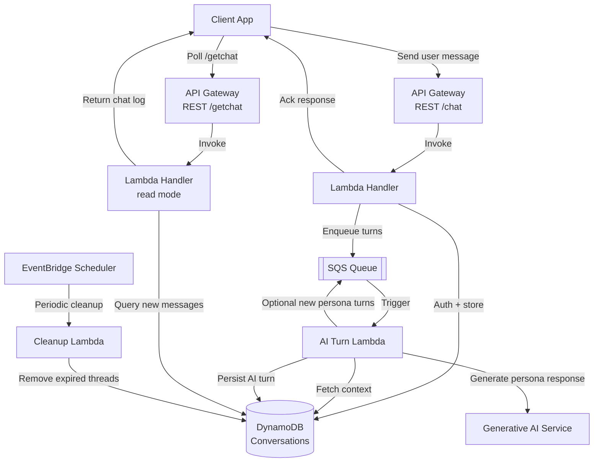

```mermaid
flowchart TD
    A[Client App] -->|Send user message| B[API Gateway<br>REST /chat]
    B -->|Invoke| C[Lambda Handler]
    C -->|Auth + store| D[(DynamoDB<br>Conversations)]
    C -->|Enqueue turns| E[[SQS Queue]]
    C -->|Ack response| A
    E -->|Trigger| F[AI Turn Lambda]
    F -->|Fetch context| D
    F -->|Generate persona response| G[Generative AI Service]
    F -->|Persist AI turn| D
    F -->|Optional new persona turns| E
    A -->|Poll /getchat| H[API Gateway<br>REST /getchat]
    H -->|Invoke| I[Lambda Handler<br>read mode]
    I -->|Query new messages| D
    I -->|Return chat log| A
    J[EventBridge Scheduler] -->|Periodic cleanup| K[Cleanup Lambda]
    K -->|Remove expired threads| D
```
