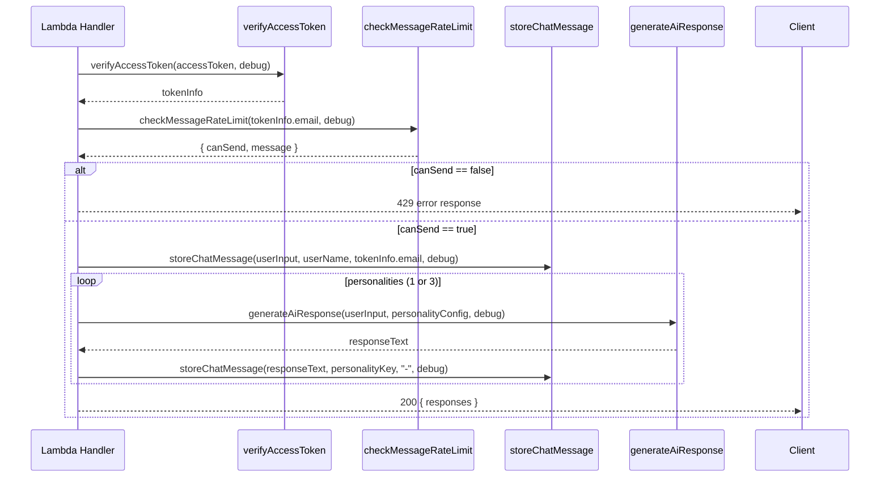

# Default Branch Calls

```mermaid
sequenceDiagram
    participant H as Lambda Handler
    participant Auth as verifyAccessToken
    participant Rate as checkMessageRateLimit
    participant Store as storeChatMessage
    participant AI as generateAiResponse

    H ->> Auth: verifyAccessToken(accessToken, debug)
    Auth -->> H: tokenInfo

    H ->> Rate: checkMessageRateLimit(tokenInfo.email, debug)
    Rate -->> H: { canSend, message }

    alt canSend == false
        H -->> Client: 429 error response
    else canSend == true
        H ->> Store: storeChatMessage(userInput, userName, tokenInfo.email, debug)
        loop personalities (1 or 3)
            H ->> AI: generateAiResponse(userInput, personalityConfig, debug)
            AI -->> H: responseText
            H ->> Store: storeChatMessage(responseText, personalityKey, "-", debug)
        end
        H -->> Client: 200 { responses }
    end
```

_Note: Each service call forwards the `debug` flag alongside request-specific parameters (input, userName, email) to control logging and context._

